# Curso de TensorFlow.js

- [Curso de TensorFlow.js](#curso-de-tensorflowjs)
  - [Modulo 1 Entender el concepto de Red Neuronal y Aprendizaje Profundo](#modulo-1-entender-el-concepto-de-red-neuronal-y-aprendizaje-profundo)
    - [Clase 1 Introduccion](#clase-1-introduccion)
    - [Clase 2 Redes Neuronales, una visita express](#clase-2-redes-neuronales-una-visita-express)
      - [La neurona](#la-neurona)
      - [Modelando una Neurona](#modelando-una-neurona)
    - [Clase 3 Aprendizaje profundo](#clase-3-aprendizaje-profundo)
      - [Backpropagation](#backpropagation)
      - [Descenso del Gradiente](#descenso-del-gradiente)
      - [Redes Neuronales Profundas](#redes-neuronales-profundas)
  - [Modulo 2 Conocer que es TensorFlow y TensorFlow.js](#modulo-2-conocer-que-es-tensorflow-y-tensorflowjs)
    - [Clase 4 Que es TensorFlow](#clase-4-que-es-tensorflow)
    - [Clase 5 TensorFlow con JavaScript](#clase-5-tensorflow-con-javascript)
    - [Clase 6 Inteligencia Artificial y ML en el navegador](#clase-6-inteligencia-artificial-y-ml-en-el-navegador)
  - [Modulo 3 Entender cuales son los componentes basicos de una Red Neuronal y cómo entrenarla](#modulo-3-entender-cuales-son-los-componentes-basicos-de-una-red-neuronal-y-cómo-entrenarla)
    - [Clase 7 Entradas, capas y salidas](#clase-7-entradas-capas-y-salidas)
      - [Componentes principales del modelo](#componentes-principales-del-modelo)
      - [Formas de crear modelos con TensorFlow.js](#formas-de-crear-modelos-con-tensorflowjs)
      - [Funcion Relu](#funcion-relu)
      - [Funcion Softmax](#funcion-softmax)
      - [Validación del Modelo](#validación-del-modelo)
      - [Ventajas de Utilizar Layers](#ventajas-de-utilizar-layers)
      - [La API Core](#la-api-core)
    - [Clase 8 Entrenando un modelo](#clase-8-entrenando-un-modelo)
      - [Preparando los Datos](#preparando-los-datos)
      - [El optimizador](#el-optimizador)
      - [Funcion de Perdida](#funcion-de-perdida)
      - [La Lista de Metricas](#la-lista-de-metricas)
      - [El entrenamiento](#el-entrenamiento)
      - [Definir parámetros batch y epochs](#definir-parámetros-batch-y-epochs)
      - [La validacion del modelo](#la-validacion-del-modelo)
      - [Hiper Parametros](#hiper-parametros)
      - [Utilizando el modelo entrenado](#utilizando-el-modelo-entrenado)
    - [Clase 9 Visualizacion del proceso de entrenamiento](#clase-9-visualizacion-del-proceso-de-entrenamiento)
      - [Clase 10 Almacenamiento de modelos de redes neuronales](#clase-10-almacenamiento-de-modelos-de-redes-neuronales)
      - [Formato de Serializacion](#formato-de-serializacion)
      - [Almacenamiento](#almacenamiento)
      - [Carga](#carga)
  - [Modulo 4 Entender cual es la forma comun de utilizar un modelo de Red Neuronal](#modulo-4-entender-cual-es-la-forma-comun-de-utilizar-un-modelo-de-red-neuronal)
    - [Clase 11 Optimizacion de modelos](#clase-11-optimizacion-de-modelos)
      - [Cuantizacion de Pesos](#cuantizacion-de-pesos)
    - [Clase 12 Modelo general de utilización](#clase-12-modelo-general-de-utilización)
    - [Clase 13 Transfiriendo el aprendizaje](#clase-13-transfiriendo-el-aprendizaje)
  - [Modulo 5 Diseñar un modelo de Regresion Lineal](#modulo-5-diseñar-un-modelo-de-regresion-lineal)
    - [Clase 14 Diseñando un modelo de regresión lineal](#clase-14-diseñando-un-modelo-de-regresión-lineal)
    - [Clase 15 Entrenando un modelo de regresión lineal](#clase-15-entrenando-un-modelo-de-regresión-lineal)
    - [Clase 16 Preparando datos para un modelo de regresión lineal](#clase-16-preparando-datos-para-un-modelo-de-regresión-lineal)
    - [Clase 16 Utilizando un modelo de regresión lineal](#clase-16-utilizando-un-modelo-de-regresión-lineal)
  - [Modulo 6 Crear una aplicacion en JavaScript que utilice un modelo de clasificacion de Imágenes](#modulo-6-crear-una-aplicacion-en-javascript-que-utilice-un-modelo-de-clasificacion-de-imágenes)
    - [Clase 18 Diseñando un modelo de clasificación de imágenes](#clase-18-diseñando-un-modelo-de-clasificación-de-imágenes)
    - [Clase 19 Utilizando un modelo de clasificación de imágenes](#clase-19-utilizando-un-modelo-de-clasificación-de-imágenes)
    - [Clase 20 Transferencia de conocimiento a un modelo de clasificación de imágenes](#clase-20-transferencia-de-conocimiento-a-un-modelo-de-clasificación-de-imágenes)

## Modulo 1 Entender el concepto de Red Neuronal y Aprendizaje Profundo

### Clase 1 Introduccion

Introduccion del profesor Alejando Santamaria sobre el aprendizaje de maquina, ejemplo mas potente identificación de imágenes para diagnostico clínico, vehículos autónomos identificando obstáculos en su ruta.

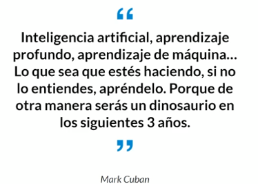


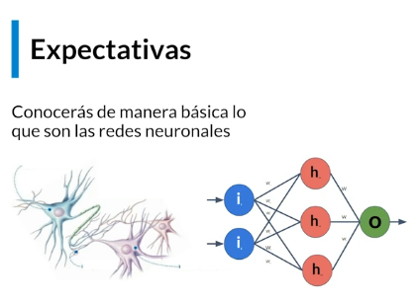

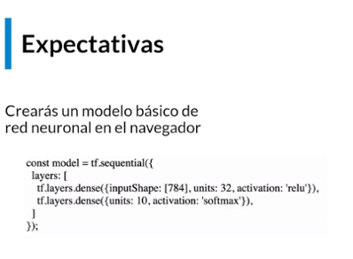

### Clase 2 Redes Neuronales, una visita express

#### La neurona

La unidad fundamental del funcionamiento del cerebro

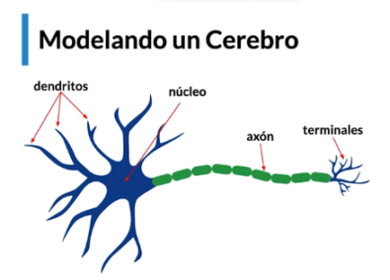

Esto nos ayuda a modelar un cerebro que nos permite hacer discernimiento dependiendo de la intensidad de la respuesta.

Las neuronas se comunican a traves de la sinapsis (conexiones entre ellas)

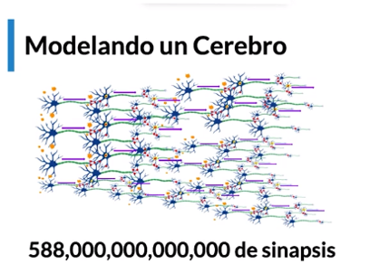

#### Modelando una Neurona

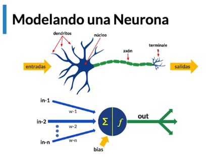

Aproximamos el modelo de una neurona mediante un perceptrón es un modelo matemático de la operación del cerebro usando pesos sinapticos y un discriminador(bias).

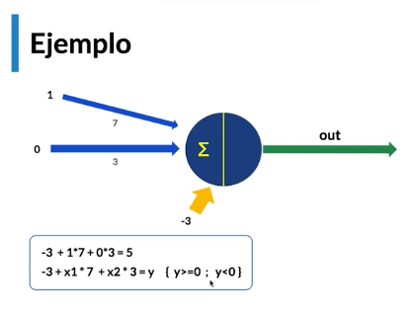

Si las entradas suman un valor lo suficientemente grande se crea un input a la salida.

Con el tiempo se han creado varias funciones de activación para suavizar esa salida.

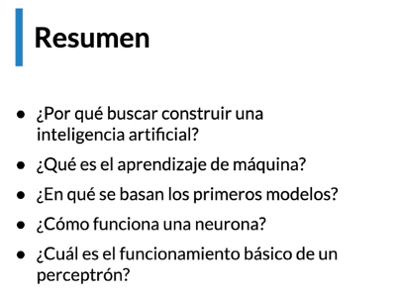

### Clase 3 Aprendizaje profundo

En la clase anterior vimos lo que es un perceptron y como modela una red neuronal en sus 3 partes principles "entradas, proceso y salidas".


Uno de los problemas principales del perceptron sencillo es que solo permite hacer discriminación lineal.

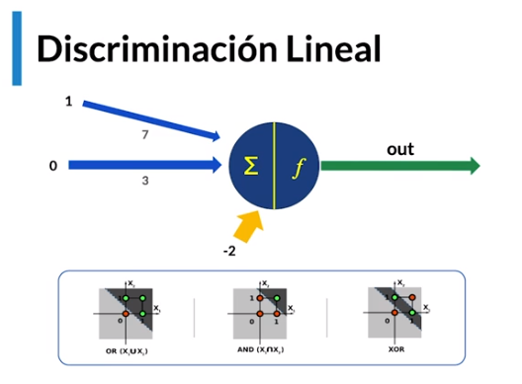

Solo se pueden separar los datos en el espacio con una linea recta,  observamos el comportamiento con compuertas lógicas, pero con XOR ya no es posible usar un perceptron sencillo y tenemos que utilizar dos lineas, ahi entra la red neuronal.

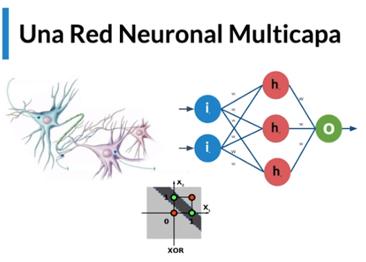

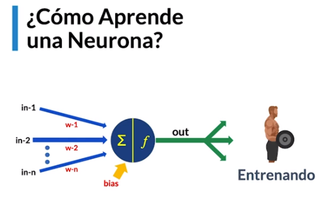

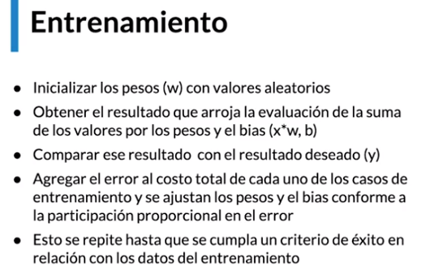

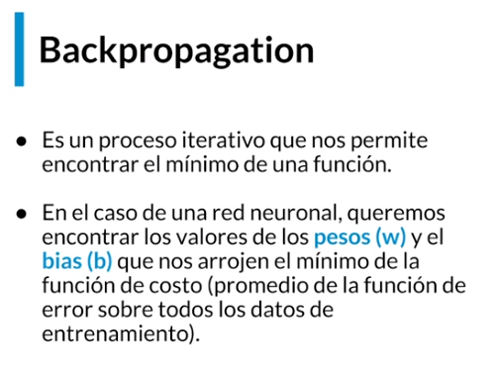

#### Backpropagation

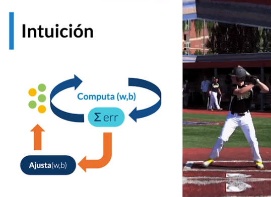

En el proceso de Backpropagation una vez sabemos que el resultado no es el correcto vamos hacia atras y ajustamos cada una de las capas y los pesos.

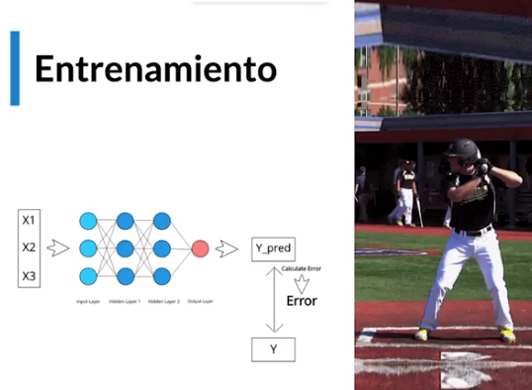

#### Descenso del Gradiente

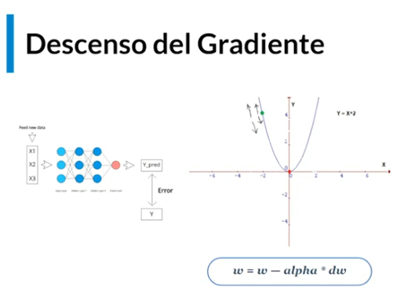

Es el algoritmo que nos permite tener el menor error posible mediante la optimizacion de la curva.

#### Redes Neuronales Profundas

Una red con mas de dos capas  ocultas es una red profunda.

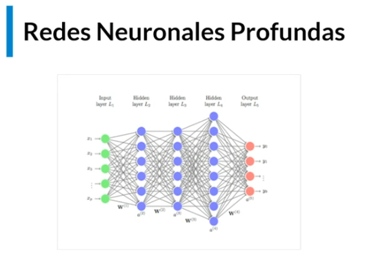

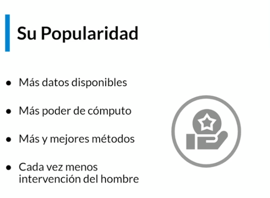

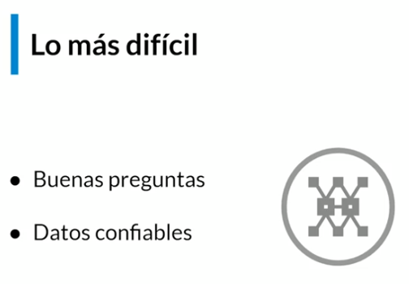

## Modulo 2 Conocer que es TensorFlow y TensorFlow.js

### Clase 4 Que es TensorFlow

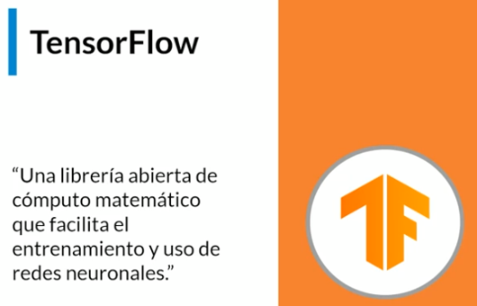

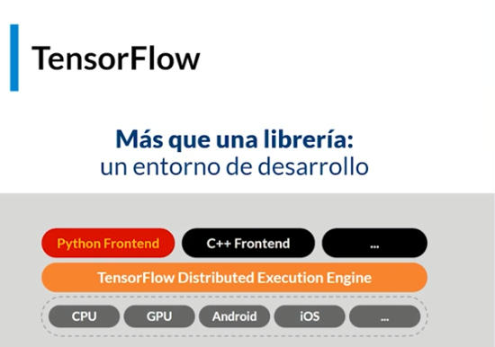

Vemos como ademas de python tambien soporta C++ y JS y como tenemos disponibilidad para diferentes sistemas y profundizamos los niveles de abstracción.

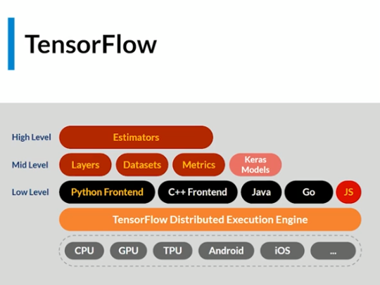

Se han creado mas herramientas.


TensorFlow tiene el propició de "Hacer cosas difíciles de manera Fácil", esto lo hace a traves del uso de un grafo Acíclico Dirigido

Caracteristicas

- Paralelismo
- Ejecución distribuida
- Compilación
- Potabilidad (de una plataforma a otra).

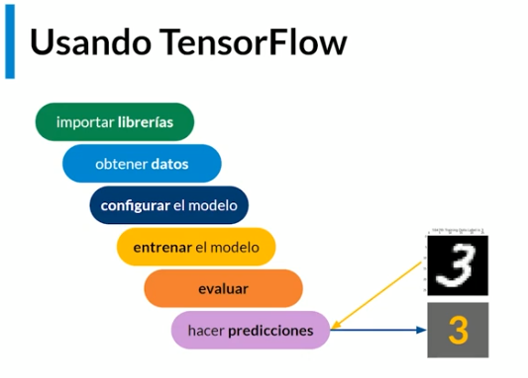

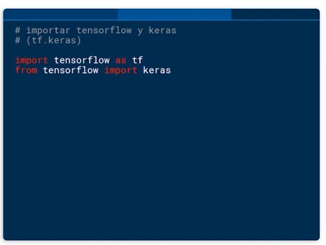

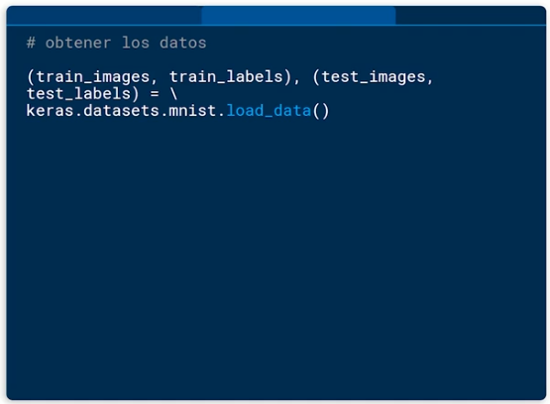

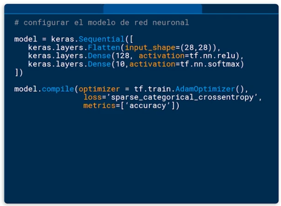

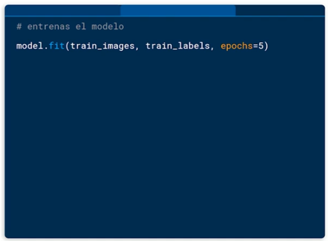

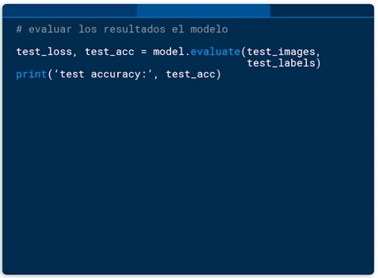

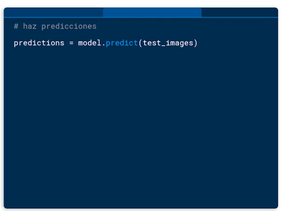

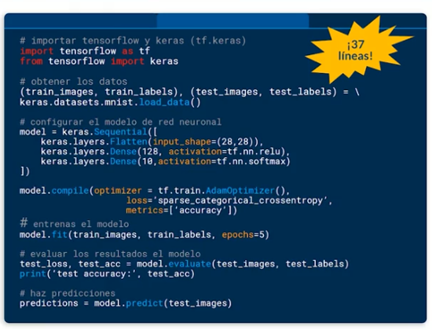

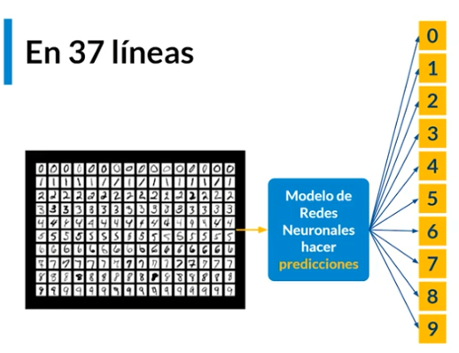

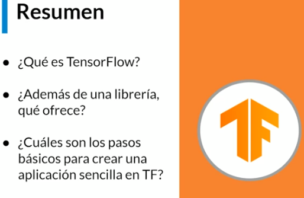

### Clase 5 TensorFlow con JavaScript

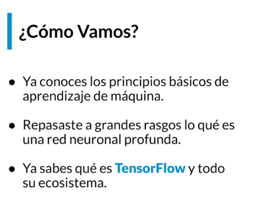


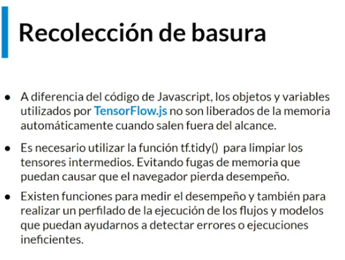

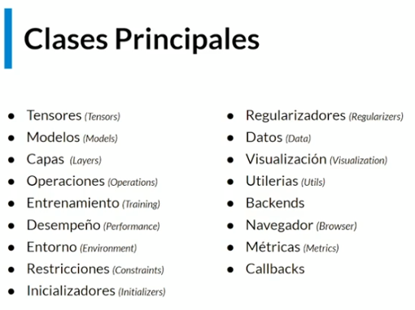

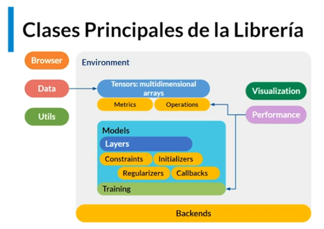

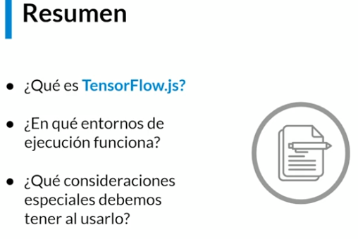

### Clase 6 Inteligencia Artificial y ML en el navegador

Dadas las limitantes de los equipos móviles:

- Memoria
- Almacenamiento
- Energía
  
Ventajas

- Javascript corre de forma nativa en navegadores
- NUmero de Desarrolladores de la comunidad


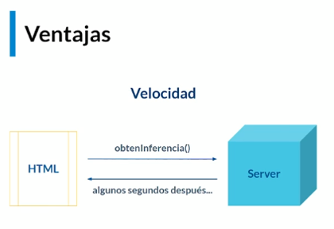

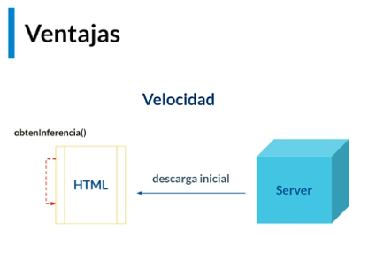

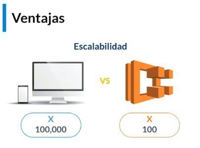

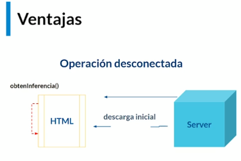

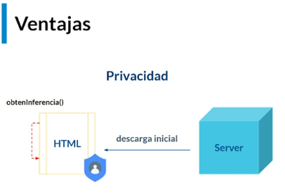

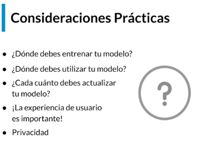

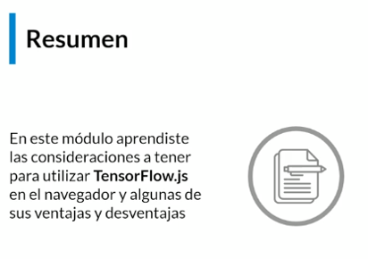

## Modulo 3 Entender cuales son los componentes basicos de una Red Neuronal y cómo entrenarla

### Clase 7 Entradas, capas y salidas

#### Componentes principales del modelo

Las capas de tu modelo se encargaran de transformar los datos que ingresen a el y hacer una de dos cosas:

- Aprender el patron que ese dato define en conjunto con otros datos de entrenamiento.

- Inferir o predecir un resultado respondiendo una pregunta.

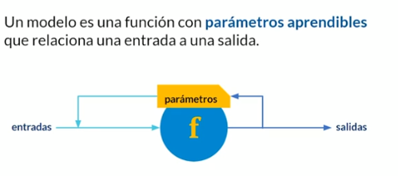

Estos parámetros en tensorFlow se ajustan con fit()

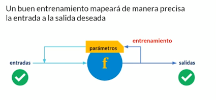

#### Formas de crear modelos con TensorFlow.js

Hay dos formas>

- A traves de la capa **api de Layers** (al principio, API de alto nivel)

- Usando la **Core api** (forma avanzada, API de bajo nivel)

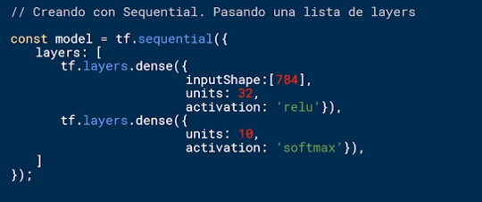

En este código inputShape es nuestra capa de entrada, units es la capa oculta, y el siguiente unit es la capa de salidas.

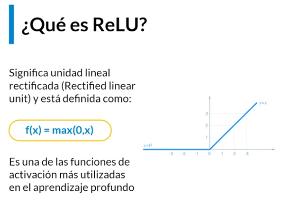

#### Funcion Relu

Es una de las funciones  mas utilizadas en deep learning ya que facilita

#### Funcion Softmax


Nos permite clasificar cosas de acuerdo a su probabilidad.

Podemos acceder en los componentes del modelo utilizando dot notation, por ejemplo:

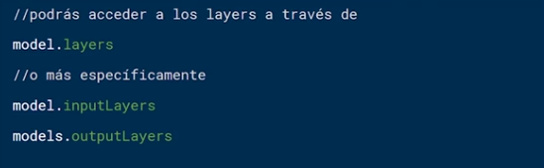

En el siguiente ejemplo vemos que antes de compilar el modelo la API de Layers te permite crear las capas de forma separado e integrarlo al modelo.

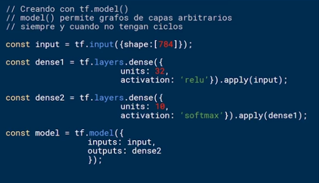

#### Validación del Modelo

Ambos modelos son instancias de **LayersModels** y requieren la especificación de la forma que recibirá la entrada (input). **TensorFlow.js** hace un calculo automático de las formas que tendrán los tensores intermedios y de crear los parámetros.

Si existiera alguna incompatibilidad entre dos capas consecutivas, la librería se encargara de notificarlo.

#### Ventajas de Utilizar Layers


#### La API Core

Si utilizas esta API tendrás mas control (es mas flexible), pero es mas difícil ya que deberás crear métodos para serializar, inicializar y validar sus parámetros.

Ejemplo


.

- Los datos pueden requerir limpieza, normalización y regularización.


Un buen entrenamiento mapeara de manera precisa la entrada que tu etiquetaste como correcta a la  salida de ese modelo


**Decisiones antes de entrenar tu modelo**.

- Un **optimizador**
- Una **Funcion de perdida**
- Una lista de **métricas**

#### El optimizador

La funcion del optimizador es decidir que tanto cambiar cada parámetro dada la precision actual, este intenta llegar a la parte mas baja de la curva.


#### Funcion de Perdida

Es el objetivo que el modelo intentara minimizar

Su meta es devolver un numero que indique "que tan mal" esta la predicción del modelo.

Este calculo se realiza para cada "lote" de datos de entrenamiento. Existen algunas funciones predefinidas como **"categoricalCrossentropy** o **"meanSquaredError"**


#### La Lista de Metricas

Es similar a las perdidas, dan un solo numero que indica que tan bien lo esta haciendo nuestro modelo.

Se computa sobre el total de los datos al final de cada época (epoch)

una vez decidido podemos compilar nuestro modelo


#### El entrenamiento

Existen dos maneras de entrenar un **LayerModel**

- model.fit()
- model.fitDataset()

Si el modelo es pequeño y cabe en la memoria usamos **model.fit()** pero si es grande necesitamos utilizar el segundo.

**model.fit()**.

Debes definir el numero de epochs y el tamaño del lote (batch), asi como cualquier callback que queramos que sea involucrado durante  o al final del proceso.

- **batch:** dividimos los datos de entrenamiento en conjuntos de datos definidos por este numero.

- **epochs:** cuantas veces queremos que se recorra de manera total el conjunto de datos.

#### Definir parámetros batch y epochs

- Normalmente se hace con ayuda de gráficas que muestran el comportamiento  del modelo y el entrenamiento y como va mejorando a traves de la precision y el error.

- Es difícil y se han creado herramientas que nos ayudan a hacerlo.

Ejemplo 2


Aquí vemos en el segundo ejemplo un epoch de 5 y un batch de 32 elementos.


model.fit() contiene los datos del entrenamiento de nuestro modelo, a los que después podemos acceder con dot notation.

#### La validacion del modelo

Una vez que el modelo esta entrenado, e incluso durante el entrenamiento del mismo, usaremos los datos separados para evaluación para ir descubriendo que tan buena es la optimizacion de los parámetros.

#### Hiper Parametros

Los Hiper Parametros son la configuración externa que recibe el modelo.

- El tamaño del batch y el numero de epochs, asi como el learning rate son parte de la optimizacion del proceso de entrenamiento de una **RNN**.

- Esos procesos suelen ser "artísticos o artesanales" y van mas allá del objetivo del curso.

- Puedes jugar con www.playground.tensorflow.org.

#### Utilizando el modelo entrenado

- Utilizamos la funcion predict()

- Los datos tienen que tener la forma (shape) esperada por el modelo (normalización regularización).


### Clase 9 Visualizacion del proceso de entrenamiento

En esta clase veremos el proceso de entrenamiento visualizándolo en un navegador web

Aquí la aplicacion de la clase <https://alex112.gitlab.io/visualizar-entrenamiento-xor-redes-neuronales/>

Y el [repositorio](https://gitlab.com/alex112/visualizar-entrenamiento-xor-redes-neuronales)

Partimos del ejemplo de una compuerta XOR programado en javascript vanilla

```js
function xorTradicional(x,y){
    strResultado = 0;
    // completar código
    if(x==0 && y==0){
        resultado = 0;
    }else if (x==1 && y==1){
        resultado = 0;
    }else{
        resultado = 1;
    }
    return resultado;
}

function pruebaXorTradicional(){
    var strResultado = "";
    for (i=0; i<datosEntrada.length; i++){
        var x = datosEntrada[i][0];
        var y = datosEntrada[i][1];
        var esperado = datosEsperados[i];
        var resultado  = xorTradicional(x,y);
        strResultado =strResultado  +  "( " + x + " , " + y + " )-->" + resultado + " (esperado: " + esperado  + " )<br>";

    }
    $("#tradresults")[0].innerHTML= strResultado;
}

```


En el primer ejemplo calculamos de acuerdo a valores booleanos, el segundo realizamos el entrenamiento dee la red con un numero aleatorio de iteraciones (epochs)


Obtenemos valores de probabilidad cercanos a 1 y cercanos a cero, realizamos un segundo entrenamiento


Observamos que este continua el entrenamiento anterior  del modelo y es acumulativo, el error disminuye aun mas con cada iteración, realizamos otro test


Los resultados convergen aun mas, si hacemos un inspect al navegador podemos ver los pesos de entrada de las capas, estos son dinámicos y se ajustan cada vez mas con cada iteración.


Cambia en el código el numero de neuronas en la capa de entrada y observa el comportamiento del error conforme las iteraciones.

#### Clase 10 Almacenamiento de modelos de redes neuronales

¿Porque es necesario?

- Para respaldar el avance de una sesión de entrenamiento (mas si estas haciendo pruebas para determinar el modelo mas cercano y tienes muchos datos o muchas iteraciones).

- Para su reutilizacion en otros dispositivos

#### Formato de Serializacion

- El formato utilizado serializará la topografía del modelo en JSON
  
- Los pesos y bias se almacenaran en un binario.

#### Almacenamiento

- tf.Model como tf.Sequential te permiten guardar la topología y los pesos de tu modelo.

- Deberás utilizar model.save()

En el siguiente ejemplo vemos como se guarda un modelo en el local storage


Tenemos varios esquemas de url


Nota: File apunta a un servidor de node.js

#### Carga

- Podrás cargar todos los modelos creados con la **API Layers**

- Tambien pueden importarse modelos **TensorFlow Python**


Ejemplo carga de modelo


## Modulo 4 Entender cual es la forma comun de utilizar un modelo de Red Neuronal

### Clase 11 Optimizacion de modelos

Esta clase toca de manera superficial el tema optimizacion.


#### Cuantizacion de Pesos

Esta operación te permitirá reducir el tamaño de tu modelo hasta un 75% de su tamaño original, para modelos de keras o python quizá haya que hacer esta operación.


Este tema debes utilizarlo al tener mas experiencia.

### Clase 12 Modelo general de utilización


Cargamos a traves de un cdn


 cargamos el modelo a traves de **tf.sequential()** **tf.loadLayersModel()**

Preparamos los datos


Realizamos la predicción


Obtener los resultados y mapear los resultados


### Clase 13 Transfiriendo el aprendizaje


Partimos de una red neuronal inicial con un modelo entrenado


Reemplazamos en un punto la salida de esa red neuronal con una mas pequeña que reciba los inputs y desarrolle una tarea en concreto.


[Enlace Aquí](https://teachablemachine.withgoogle.com)

## Modulo 5 Diseñar un modelo de Regresion Lineal

### Clase 14 Diseñando un modelo de regresión lineal


A los modelos  podemos pasarle mas parametros como el peso del auto, el tipo de neumáticos, de caja, numero de cilindros, etc.


Para una casa tambien podemos codificar mas variables.


### Clase 15 Entrenando un modelo de regresión lineal

Recordemos los pasos para nuestro modelo


Y creamos un template donde importamos las librerías de tensorFlow via cdn

```html
<!DOCTYPE html>
<html lang="en">
<head>
    <meta charset="UTF-8">
    <meta name="viewport" content="width=device-width, initial-scale=1.0">
    <title>Modelo Regresion</title>
    <script src="https://cdn.jsdelivr.net/npm/@tensorflow/tfjs@1.7.4/dist/tf.min.js">
    </script>
    <script src="https://cdn.jsdelivr.net/npm/@tensorflow/tfjs-vis@1.0.2/dist/tfjs-vis.umd.min.js">
    </script>

</head>
<body>
    <script type=" " src="script.js"></script>
</body>
</html>
```

Y desarrollamos nuestro código en el archivo script.js

```js
async function getData() {
    const API_URL = 'https://raw.githubusercontent.com/celismx/tensorflowjs.json/master/datos.json'
    const datosCasasR = await fetch(API_URL);
    const datosCasas = await datosCasasR.json();
    var datosLimpios = datosCasas.map(casa => ({
        precio: casa.Precio,
        cuartos: casa.NumeroDeCuartosPromedio
    }))
    datosLimpios = datosLimpios.filter(casa => (casa.precio != null && casa.cuartos != null));
    return datosLimpios;
}

function visualizarDatos(data) {
    const valores = data.map(d => ({ x: d.cuartos, y: d.precio }));

    tfvis.render.scatterplot(
        { name: 'Cuartos vs Precio' },
        { values: valores },
        {
            xLabel: 'Cuartos',
            yLabel: 'Precio',
            height: 300
        }
    );
}

function crearModelo() {
    const modelo = tf.sequential()
    // primer capa
    modelo.add(tf.layers.dense({ inputShape: [1], units: 1, useBias: true }));

    // Segunda capa
    modelo.add(tf.layers.dense({ units: 1, useBias: true }));
    return modelo
}


async function run() {
    //body..
    const data = await getData()

    visualizarDatos(data);
    crearModelo();
}

run();
```


### Clase 16 Preparando datos para un modelo de regresión lineal

Agredamos la funcion convertirDatosATensores al script

```js

const optimizador = tf.train.adam();
const funcion_perdida = tf.losses.meanSquaredError;
const metricas = ['mse'];


async function entrenarModelo(model, inputs, labels) {
    model.compile({
        optimizer: optimizador,
        loss: funcion_perdida,
        metrics: metricas,
    });


    const surface = { name: 'show.history live', tab: 'Training' };
    const batchSize = 28;
    const epochs = 50;
    const history = [];

    return await model.fit(inputs, labels, {
        batchSize,
        epochs,
        shuffle: true,
        callbacks: tfvis.show.fitCallbacks(
            {name: 'Training Performance'},
            ['loss', 'mse'],
            { height: 200, callbacks: ['onEpochEnd']}
        )
    })
}
// normalizado de datos
function convertirDatosATensores(data) {
    return tf.tidy(() => {
        tf.util.shuffle(data);

        const entradas = data.map(d => d.cuartos);
        const etiquetas = data.map(d => d.precio);
        const tensorEntradas = tf.tensor2d(entradas, [entradas.length, 1]);
        const tensorEtiquetas = tf.tensor2d(etiquetas, [etiquetas.length, 1]);

        const entradasMax = tensorEntradas.max();
        const entradasMin = tensorEntradas.min();
        const etiquetasMax = tensorEtiquetas.max();
        const etiquetasMin = tensorEtiquetas.min();

        // (dato-min)/(max-min)
        const entradasNormalizadas = tensorEntradas.sub(entradasMin)
            .div(entradasMax.sub(entradasMin));
        const etiquetasNormalizadas = tensorEtiquetas.sub(etiquetasMin)
            .div(etiquetasMax.sub(etiquetasMin));

        return {
            entradas: entradasNormalizadas,
            etiquetas: etiquetasNormalizadas,
            entradasMax,
            entradasMin,
            etiquetasMax,
            etiquetasMin,
        }
    })
};

var modelo;

async function run() {
    //body..
    const data = await getData()

    visualizarDatos(data);
    modelo = crearModelo();

    const tensorData = convertirDatosATensores(data);
    const { entradas, etiquetas } = tensorData;
    entrenarModelo(modelo,entradas, etiquetas);
}

run();
```


### Clase 16 Utilizando un modelo de regresión lineal

Una vez entrenado el modelo creamos un botón para guardar el entrenamiento del mismo, y detener entrenamiento

```html
<body>

    <input type="button" value="Detener Entrenamiento" onclick="stopTraining=true;">
    <input type="button" value="Guardar Modelo" onclick="guardarModelo();" /> <br>

    <script type="" src="./script.js"></script>
</body>
```

Agregamos las funciones a script.js

```js
var stopTraining;

async function entrenarModelo(model, inputs, labels) {
    model.compile({
        optimizer: optimizador,
        loss: funcion_perdida,
        metrics: metricas,
    });


    const surface = { name: 'show.history live', tab: 'Training' };
    const batchSize = 28;
    const epochs = 50;
    const history = [];

    return await model.fit(inputs, labels, {
        batchSize,
        epochs,
        shuffle: true,
        // modificamos el callback para poder detener el training
        callbacks: {
            onEpochEnd: (epoch, log) => {
                history.push(log);
                tfvis.show.history(surface, history, ['loss', 'mse']);

                if(stopTraining) {
                    modelo.stopTraining = true;
                }

            }
        }
    })
}

//Agregamos funcion para almacenar el modelo
async function guardarModelo() {
    const saveResult = await modelo.save('downloads://modelo-regresion')
}
```

Recargamos y ahora podemos usar las funcionalidades, al guardar obtenemos 2 archivos `modelo-regresion.weights.bin` con los binarios del modelo, y `modelo-regresion.json` con la topologia del modelo.

Agregamos al body los botones para cargar los archivos

```html
JSON File <input type="file" id="upload-json" /><br>
Binary File <input type="file" id="upload-weights" /><br>
<input type="button" value="Cargar Modelo" onclick="cargarModelo();" /> <br>
```

Recargamos el navegador para iniciar otro entrenamiento, lo detenemos, guardamos el modelo y posterior lo cargamos, en este punto tenemos el mensaje en la consola como notificación.


Ya cargamos el modelo, pero como saber si los datos son optimizados, agregaremos un botón para cargar datos de forma manual, y posterior cargar el modelo para  desplegar la regresion lineal

```html
    <input type="button" value="Curva de Inferencia" onclick="verCurvaInferencia();" /> <br>
```

```js
//Mostrar curva de inferencia()
// toma los datos hace proceso de denormalizacion
async function verCurvaInferencia() {
    var data = await getData();
    var tensorData = await convertirDatosATensores(data);
    const { entradasMax, entradasMin, etiquetasMax, etiquetasMin } = tensorData;

    const [xs, preds] = tf.tidy(() => {

        const xs = tf.linspace(0, 1, 100);
        const preds = modelo.predict(xs.reshape([100, 1]));

        const desnormX = xs
            .mul(entradasMax.sub(entradasMin))
            .add(entradasMin);

        const desnormY = preds
            .mul(etiquetasMax.sub(etiquetasMin))
            .add(etiquetasMin);

        // Un=normalize the data
        return [desnormX.dataSync(), desnormY.dataSync()];
    });

    const puntosPrediccion = Array.from(xs).map((val, i) => {
        return { x: val, y: preds[i] }
    });

    const puntosOriginales = data.map(d => ({
        x: d.cuartos, y: d.precio,
    }));

    tfvis.render.scatterplot(
        { name: 'Prediccion vs Originales' },
        { values: [puntosOriginales, puntosPrediccion], series: ['originales', 'predicciones'] },
        {
            xLabel: 'Cuartos',
            yLabel: 'Precio',
            height: 300
        }
    );

}
```


## Modulo 6 Crear una aplicacion en JavaScript que utilice un modelo de clasificacion de Imágenes

### Clase 18 Diseñando un modelo de clasificación de imágenes

En esta clase diseñamos un modelo de clasificacion de imágenes y aprenderemos un poco de la transferencia de conocimiento.


AL entrenar el modelo nos dará como output la probabilidad de que el objeto corresponda  (ejemplo a una pizza), la probabilidad varia según el entrenamiento que se siguió y la precision que tuvo la red.

Estos modelos ademas de identificar el objeto que les estas mostrando tambien nos entrega todo el resto de categorías que ese modelo aprendió


Como observas la suma de los porcentajes da 100% de probabilidad.


La clasificacion depende muchas variables, por ejemplo la iluminación.


Distintos ángulos de incidencia o de intensidad impactan  en la forma en como es entrenado el modelo.


La pose interfiere en el clasificador, siempre usa fotos que tengan el mismo formato.


Es posible que al realzar o presentar alguna distorsión obtengamos un resultado distinto.

Los coches que se manejan de forma autónoma, poniendo un panel transparente encima de los objetos de la calle se puede engañar al algoritmo.

Por ello debemos incluir mecanismos de seguridad para que el vehículo opere no solo con lo que ve sino con otra serie de sensores al rededor del vehículo autónomo.


Usaremos los pixels en cada foto, es importante que si usas fotos en BN seguir usando BN

### Clase 19 Utilizando un modelo de clasificación de imágenes

En esta clase veremos como utilizar un modelo de clasificacion de imágenes, es un modelo pre entrenado por google y que podrás descargar a tus aplicaciones para darle los usos que tu quieras, el uso en particular que realizaremos es el de transferencia de conocimiento.

Primero vamos a aprender como usar el clasificador y después como anexar la transferencia de conocimiento que vamos a utilizar para este ejemplo.

Creamos el proyecto igual que el anterior con un index.html y un archivo script.js

```html
<!DOCTYPE html>
<html lang="es">
    <head>
        <meta charset="UTF-8">
        <title>
            Modelo Regresion
        </title>
        <!-- Importar TensorFlow.js -->
        <script src="https://cdn.jsdelivr.net/npm/@tensorflow/tfjs"></script>
        <script src="https://cdn.jsdelivr.net/npm/@tensorflow-models/mobilenet"></script>

        <style>
            body {
                background-color: azure;
            }
        </style>

    </head>

    <body>
        
        <div id="descripcion_imagen"></div>
        <button onclick="cambiarImagen();">Cambiar imagen</button>
        Importar el archivo principal
        <script src="script.js"></script>
    </body>

</html>
```

```js
let net;

const imgEl = document.getElementById('img');
const descEl = document.getElementById('descripcion_imagen');

async function app() {

    // cargamos todos los parametros de mobilenet
    // tiene definidos con su entrenamiento
    net = await mobilenet.load();

    // Método classify
    var result = await net.classify(imgEl);
    console.log(result);
}

app();
```

Iniciamos http-server y deshabilitamos el cache del navegador

```bash
npx http-server
```


Una vez hecho el test, agregamos las siguientes funciones para cargar nuevas imágenes y pasarlas al test.

```js
let net;

const imgEl = document.getElementById('img');
const descEl = document.getElementById('descripcion_imagen');

async function app() {

    // cargamos todos los parametros de mobilenet
    // tiene definidos con su entrenamiento
    net = await mobilenet.load();

    // Método classify
    var result = await net.classify(imgEl);
    console.log(result);
}

imgEl.onload = async function () {
    displayImagePrediction();
}

async function displayImagePrediction() {
    try {
        result = await net.classify(imgEl);
        descEl.innerHTML = JSON.stringify(result);
    } catch (error) {

    }
};

count = 0;

async function cambiarImagen() {
    count = count + 1
    imgEl.src = "https://picsum.photos/200/300?random=" + count;

}
app();
```

### Clase 20 Transferencia de conocimiento a un modelo de clasificación de imágenes

Una vez que ya aplicamos el modelo de reconocimiento de imágenes pasaremos a realizar la transferencia de conocimiento, esto involucrara el uso de un nuevo modelo que calcula la distancia entre los puntos es decir datos del clasificador de imágenes respecto a una sola imagen y nos puede decir que tan lejos esta respecto a otra.

Agregamos el componente de video al body de nuestro index.html

Crea un certificado y un archivo cert.pem de acuerdo ala [documentación de Http-server](https://www.npmjs.com/package/http-server)

```bash
openssl req -newkey rsa:2048 -new -nodes -x509 -days 3650 -keyout key.pem -out cert.pem
```

Iniciar el server

```bash
npx http-server -S -C cert.pem
```

```html
        <video autoplay="" playsinline muted id="webcam" width="224" height="224"></video>
```

Agrega  al script las variables para iniciar la webcam

```js
     const webcamElement = document.getElementById('webcam');


async function app() {

    // cargamos todos los parametros de mobilenet
    // tiene definidos con su entrenamiento
    net = await mobilenet.load();

    // Método classify 
    var result = await net.classify(imgEl);
    console.log(result);
    displayImagePrediction();

    webcam = await tf.data.webcam(webcamElement);

    while(true){
        const img = await webcam.capture();

        const result = await net.classify(img);

        document.getElementById('console').innerHTML = 'prediction' 
            + result[0].className + "probability" + result[0].probability

    // elimina imagen de memoria
    img.dispose()

    await tf.nextFrame();
    }
}
```

Ahora implementaremos el KKK (clasificador de vecinos cercanos), este no esta entrenado, pero te permite saber que tan lejos estan las cosas unas de otras.

Agregamos el siguiente script en head y algunos botones para determinadas predicciones en el body

```html
<!DOCTYPE html>
<html>
    <head>
        <!-- Load the latest version of TensorFlow.js -->
        <script src="https://cdn.jsdelivr.net/npm/@tensorflow/tfjs"></script>
        <script src="https://cdn.jsdelivr.net/npm/@tensorflow-models/mobilenet"></script>
        <script src="https://cdn.jsdelivr.net/npm/@tensorflow-models/knn-classifier"></script>
        <title>
            Clasificación de Imágenes y Transferencia de Conocimiento</title>
    </head>
    <body>

        <!-- Add an image that we will use to test -->
        
        <div id="descripcion_imagen"></div>
        <button id="cambiaImagen" onclick="cambiarImagen();">Cambiar imagen</button>

        <br>
        <video autoplay playsinline muted id="webcam" width="224" height="224"></video>
        <div id="console"></div><br>
        <div id="console2"></div><br>
        <button id="clase-a" onclick="addExample(1)">Gato</button>
        <button id="clase-b" onclick="addExample(2)">Dino</button>
        <button id="clase-c" onclick="addExample(3)">Alex</button>
        <button id="clase-d" onclick="addExample(4)">OK</button>
        <button id="clase-e" onclick="addExample(5)">Rock</button><br>
        <!-- Load index.js after the content of the page -->
        <script src="script.js?v=15"></script>
        <br/>
        <br/>
        <br/>
        <button id="saveKnn" onclick="saveKnn();">Almacenar configuración</button>
        <br/>
        <button id="loadKnn" onclick="loadKnn();">Recuperar configuración</button>

    </body>
</html>


```

Agregamos a script.js lo siguiente

```js
let net;

const imgEl = document.getElementById('img');
const descEl = document.getElementById('descripcion_imagen');
const webcamElement = document.getElementById('webcam');
const classifier = knnClassifier.create();


async function app() {

    // cargamos todos los parametros de mobilenet
    // tiene definidos con su entrenamiento
    net = await mobilenet.load();

    // Método classify
    var result = await net.classify(imgEl);
    console.log(result);
    displayImagePrediction();

    webcam = await tf.data.webcam(webcamElement);

    while(true){
        const img = await webcam.capture();

        const activation = net.infer(img, "conv_preds");

        var result2;

        // creamos red en tiempo real
        try {
            result2 = await classifier.predictClass(activation);
            const classes = ["Untrained", "Gato", "Dino", "Alex", "OK", "Rock"]
            document.getElementById('console2').innerHTML = "Console2 prediction: " + classes[result2.label];

        } catch(error){
            console.log('Modelo aun no configurado')
        }

        document.getElementById('console').innerHTML = 'prediction' 
            + result[0].className + "probability" + result[0].probability

            // elimina imagen de memoria
            img.dispose()

            await tf.nextFrame();
        }
}


imgEl.onload = async function () {
    displayImagePrediction();
}

async function displayImagePrediction() {
    try {
        result = await net.classify(imgEl);
        descEl.innerHTML = JSON.stringify(result);
    } catch (error) {

    }
};

async function addExample(classId) {
    console.log('Added Example')
    const img = await webcam.capture();
    const activation = net.infer(img, true);
    classifier.addExample(activation, classId);

    img.dispose();
}

count = 0;

async function cambiarImagen() {
    count = count + 1
    imgEl.src = "https://picsum.photos/200/300?random=" + count;

}
app();
```

El ejemplo del profesor

Utilizar un modelo de clasificación de imágenes y transferencia de conocimiento.

Demo:
<https://alex112.gitlab.io/transferencia-de-conocimiento-tensorflowjs>

Repositorio:
<https://gitlab.com/alex112/transferencia-de-conocimiento-tensorflowjs.git>